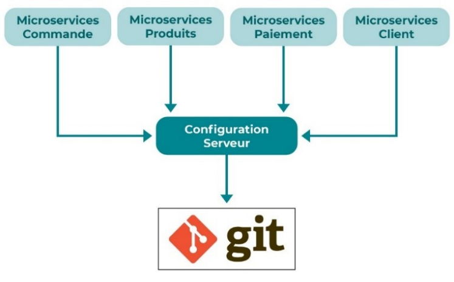
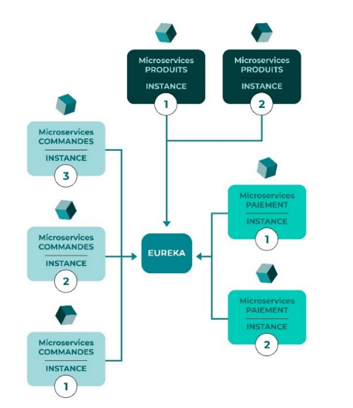
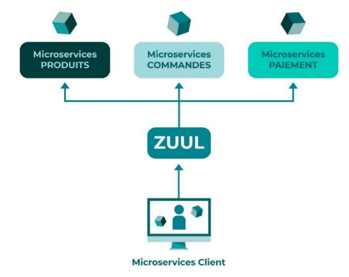
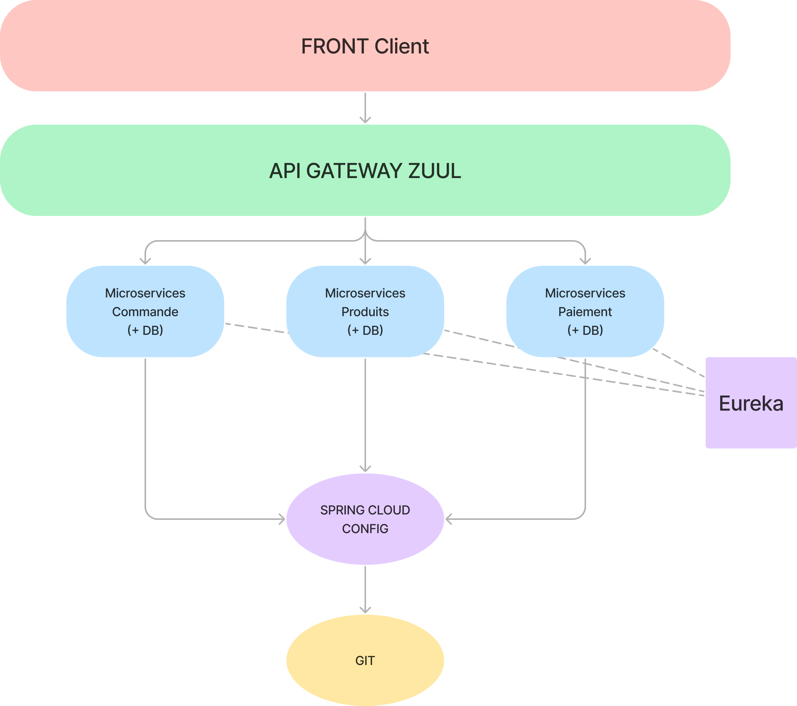
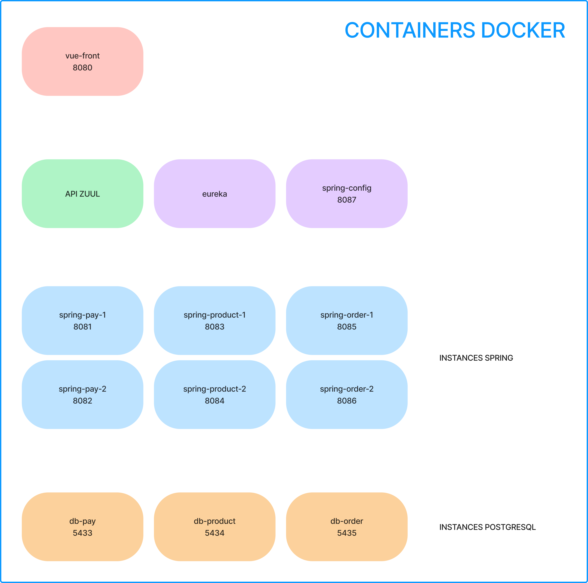
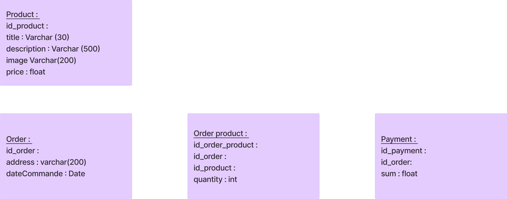

# Microservices FISA4
Implementation of a e-commerce project with microservices.
## Introduction
This project aim to implement an e-commerce project in microservices architecture. The project is composed of 3 microservices:
- **Product Service**: This service is responsible for managing the products. It provides the CRUD operations for the products.
- **Order Service**: This service is responsible for managing the orders. It provides the CRUD operations for the orders.
- **Payment Service**: This service is responsible for managing the payments. It provides the CRUD operations for the payments.

To do so we have to :
- decentralize the configuration of the microservices<br>

- use Eureka as a service registry and discovery service<br>

- use Zuul as an API gateway to simplify the access to the microservices<br>



## Technologies
- Java 17
- Maven
- Docker
- Vue.js
- Spring Boot
- Spring Cloud
- Eureka
- Zuul
- PostgreSQL

## Initial Setup
1. Clone the repository
2. Open the project in your favorite IDE
3. Run the following command to build the project
```bash
sh docker-build.sh
```
4. Open your browser and go to localhost:8080 to access the site

## Architecture
We chose to implement the following architecture:


## Docker Containers
To respect the architecture and the subject we were given, we chose to use Docker to deploy our microservices. We have 13 containers:

- 3 are the instances of the databases needed
- 6 are the instances of the back-end microservices (we have 3 of them and to instances for each)
- 1 is for the front end
- 1 is for the Eureka server
- 1 is for the Zuul server
- 1 is for the spring config server
On the image, we can see the port used by each container.

## Datas 
The project uses a PostgreSQL database. The database is initialized following this schema:


## App
The app is a simple e-commerce website. You can see the products, add them to your cart, and order them. 
As a mock exemple, we decided to sell air. You can choose air from different regions of France and add them to your cart.
You can then pay the order.

/!\ The payment is not real, it is a mock payment. The payment service will always return a success after checking the card number given using the Luhn algorithm.<br>
/!\ Selling air is not a real business, it is just a mock example. It may even be illegal depending and where you are.<br>

## External ressources
https://docs.spring.io/spring-cloud-config/docs/current/reference/html/<br>
https://www.baeldung.com/spring-cloud-configuration<br>
https://spring.io/guides/gs/service-registration-and-discovery/<br>
https://www.baeldung.com/spring-cloud-netflix-eureka<br>
https://spring.io/guides/gs/gateway/<br>
https://www.baeldung.com/spring-rest-with-zuul-proxy<br>


## Team
[Léo Wadin](https://github.com/ArKc0s)<br>
[Elena Beylat](https://github.com/PetitCheveu)<br>
[Aurélien Houdart](https://github.com/Zaykiri)<br>
